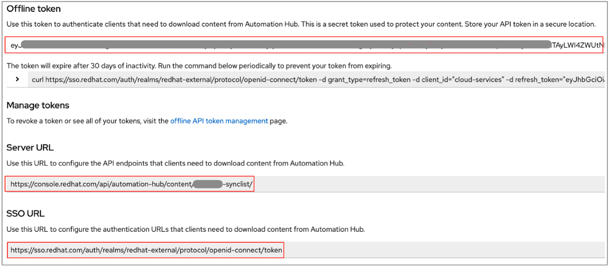
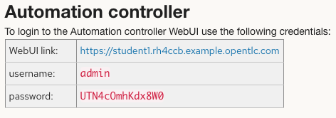
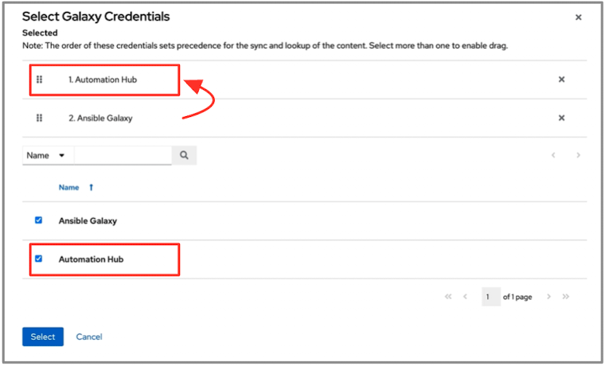

# Exercise 2.1 - Environment Prep

## Table of Contents

* [Objective](#objective)
* [Step 1 - Add Credentials for Automation Hub](#step-1---add-credentials-for-automation-hub)
* [Step 2 - Add Automation Hub credentials to Default Organization](#step-2---add-automation-hub-credentials-to-default-organization)

## Objective

This lab environment was not originally designed and configured to build custom EE’s so we will use Ansible automation to install and partially configure the Ansible Builder environment.

We will need to use some Certified and Community collections to retrofit our Automation Controllers.  When we run a job template from a project with the requirements.yml file, it will pull the collections down from the Red Hat hosted Automation Hub.

> **Tip**
>
> Not all collections have to be installed in containers, however, it is recommended to leverage the benefits stated earlier.  For this scenario, we will install some collections in a requirements.yml file in the project because we don’t have an EE yet with all the collections necessary to do so.  

### Step 1 - Add Credentials for Automation Hub

> **Warning**
>
> Before proceeding, confirm that no other individuals or groups within your company have already generated a token for the hosted Automation Hub associated with your portal account at console.redhat.com.
> 
> Clicking **"Load token"** will generate a new token and previous tokens will be invalid

* One user with administrator access must retrieve these values from [console.redhat.com](https://external.ink?to=/console.redhat.com/ansible/automation-hub/token#) -> click **"Load token"** 
* Provide the resulting fields to the rest of the students 

  

* Login as **admin** to your Automation Controller 

* Go to: **Resources -> Credentials -> Add**

* Fill out the form as follows:
&nbsp;&nbsp;&nbsp;&nbsp;&nbsp;<table>
    <tr>
      <th>Parameter</th>
      <th>Value</th>
    </tr>
    <tr>
      <td>NAME</td>
      <td>Automation Hub</td>
    </tr>
    <tr>
      <td>ORGANIZATION</td>
      <td>Default</td>
    </tr>
    <tr>
      <td>CREDENTIAL TYPE</td>
      <td>Ansible Galaxy/Automation Hub API Token*</td>
    </tr>
    <tr>
      <td>GALAXY SERVER URL</td>
      <td>Get from Your Instructor</td>
    </tr>
    <tr>
      <td>Auth Server URL</td>
      <td>Get from your Instructor</td>
    </tr>
    <tr>
      <td>API Token</td>
      <td>Get from your Instructor</td>
    </tr>
  </table>

* Click **Save**

### Step 2 - Add Automation Hub credentials to Default Organization

* **Access** -> **Organizations** -> Click “**Default**” Organization -> **Edit** button 
* Click **Galaxy Credentials** Magnifying Glass Icon 
* Check “**Automation Hub**” 
 
\*\*Ensure “Automation Hub” is checked, then drag it into the 1st search location (at the top) Click “Select” Click “Save”
* click “**Select**” button -> 
* Click “**Save**” button

----

[Return to the Workshop Exercises](../README.md)