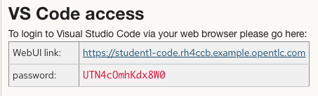
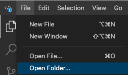
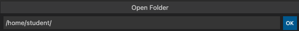
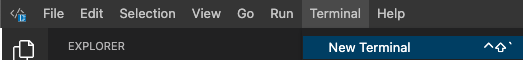
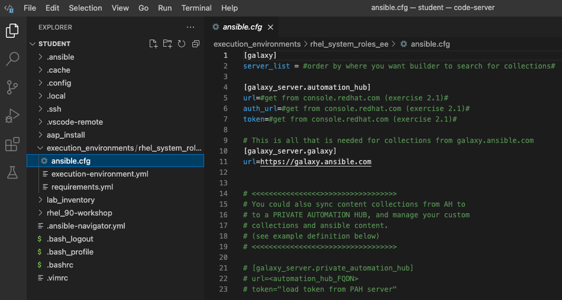
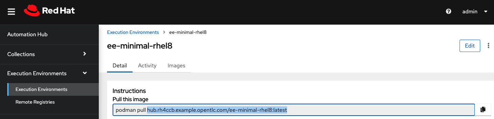
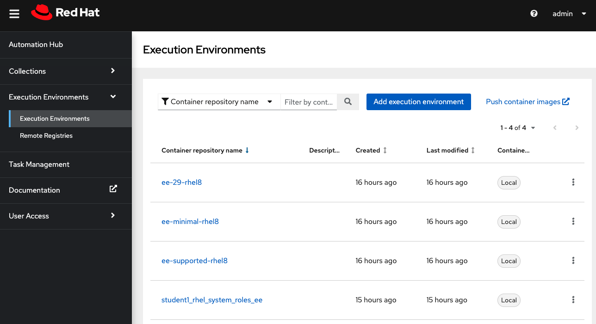
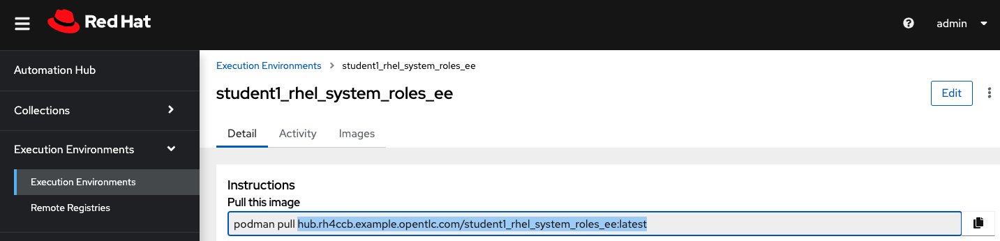

# Exercise 2.3 - Add Execution Environment for RHEL System Roles

## Table of Contents

* [Objective](#objective)
* [Step 1 - Run “LINUX / Setup Builder”](#step-1---run-linux--setup-builder)
* [Step 2 - Create custom Execution Environment with RHEL System Roles collection](#step-2---create-custom-ee-with-rhel-system-roles-collection)
    * [2.1 - Access Terminal](#21---access-terminal)
    * [2.2 - Tell builder where to look for collections](#22---tell-builder-where-to-look-for-collections)
    * [2.3 - Define how you want your EE built](#23---define-how-you-want-your-ee-built)
    * [2.4 - Add RHEL System Roles collection](#24---add-rhel-system-roles-collection)
    * [2.5 - Pull down base image](#25---pull-down-base-image)
    * [2.6 - Build EE](#26---build-ee)
    * [2.7 - Add EE to Automation Controller](#27---add-ee-to-automation-controller)

## Objective

In Exercise 3 from Section 1 of this workshop, you were able to do a deep dive into Ansible Builder.  But what happens after that?  You need to store your EE's where they can be shared and version controlled.  This time you will be creating your own custom EE in your personal workshop environment. From there you will push it to a Private Automation Hub that is shared by all the students.  Once you have your EE's in a container repository (such as PAH) you need to put it into production by adding it to your Automation Controller. 

### Step 1 - Run “LINUX / Setup Builder”

In exercise 2.2, the "LINUX / Setup Builder" job template was created.  Now we will execute this job template to build out an Ansible Builder environment on our controller node (**ansible-1** in **Workshop Inventory**). 

* Go to: **Resources** -> **Templates** -> launch **LINUX / Setup Builder**
    * Enter **“ansible-1”** for "**Server Name or Pattern"** in Survey
    * Click **Next**
    * Click **Launch**

### Step 2 - Create custom EE with RHEL System Roles collection
By running **Linux / Setup Builder**, we installed Ansible Builder on our control node.  So let's get to our ansible-1 (control node) terminal and finish configuring how we want our custom execution environment built, build the EE, push it to PAH, then pull it into Automation Controller from the PAH.

#### 2.1 - Access Terminal

* Access Terminal on **ansible-1** through VSCode:<br>

* Open "/home/student/" folder: <br>

* Enter "/home/student/" and click ok<br>

* Start a terminal sesesion:<br>


#### 2.2 - Tell builder where to look for collections
Each customer exeuction environment should be built from it's own project directory.  The project directory for your custom ee is called **rhel_system_roles_ee**.  The EE project directory contains all the configuration files needed to define how your container is built; like where to search for collections and in what order. 
* Open the execution_environments/rhel_system_roles_ee/ansible.cfg file:<br>

* Edit **server_list** to list search precidence for collections.  Update your file as follows:<br>
```ini
[galaxy]
server_list = automation_hub, galaxy
```
* Complete the **\[galaxy_server.automation_hub\]** **url**, **auth_url**, and **token** information:
    * **\[galaxy_server.automation_hub\]**: gathered from console.redhat.com (in [Section 2/Exercise 1/Step 1](../2.1-evnironment-prep/README.md) of this workshop)<br><br>
      > **Warning**
      > 
      > Don't load token again, it will invalidate the token we set up in Automation Controller.
      > Use the token already generated
    * **\[galaxy_server.galaxy\]:** is already configured for you
    * Final ansible.cfg file looks like:<br><br>
      > **Warning**
      > 
      > Tokens and urls will be different
  
```ini
[galaxy]
server_list = automation_hub, galaxy
 
[galaxy_server.automation_hub]
url="https://console.redhat.com/api/automation-hub/content/#######-synclist/"
auth_url="https://sso.redhat.com/auth/realms/redhat-external/protocol/openid-connect/token"
token="eyJhbGciOiJIUz…RamQrAStW5FwYR6UhGBQ1v4Y"
 
[galaxy_server.galaxy]
url=https://galaxy.ansible.com
```

#### 2.3 - Define how you want your EE built
The **execution_environment.yml** file is located in the rhel_system_roles_ee project directory.  It defines how the EE will be built.
* Add **version:** directive.  This is the first version of this EE, so we can start with 1.  If you later make changes to the container that will replace existing EE, you will use 2, and so on.  Versions do not have to be a number.
```yaml
---
version: 1
```
* Next, Add **dependencies:**. We are going to be installing this collection from a collection on a galaxy server.  To build collections into EEs, you need to add the FQCN (Fully Qualified Collection Name) to the **requirements.yml** file. (note: packages are added to bindep.txt file and python dependencies are added to requirements.txt as shown in comment fields)
```yaml
dependencies:
  galaxy: requirements.yml
#  python: requirements.txt
#  system: bindep.txt
```
* Add **build_arg_default:s** dictionary variable that defines options/specifications on how you would like to build the EE.
```yaml
build_arg_defaults:
  EE_BASE_IMAGE: 'hub.XXXXXX.example.opentlc.com/ee-minimal-rhel8:latest'
```
  > **Tip**
  >
  > You can copy and paste the base image from your Private Automation Hub (shown below)
  > 
* Finally, you need to tell builder where your ansible.cfg file is.  Best practice is for it to be in your ee project directory.  Append the following line to the end of your execution_environment.yml file:
```bash
ansible_config: ansible.cfg
```
* You could optionally add commands you would like to run inside the container image before it is built and after it is built. (EXAMPLE ONLY:)
```yaml
#additional_build_steps:
#  prepend: |
#    RUN whoami
#    RUN cat /etc/os-release
#  append:
#    - RUN dnf install -y rhel-system-roles
#    - RUN ls -la /etc
```
* Here is an example of what your execution_environment.yml would look like for this exercise:
```yaml
---
version: 1

dependencies:
 galaxy: requirements.yml
# python: requirements.txt
# system: bindep.txt 
 
build_arg_defaults:
 EE_BASE_IMAGE: 'hub.XXXXXX.example.opentlc.com/ee-minimal-rhel8:latest'

ansible_config: ansible.cfg
```

#### 2.4 - Add RHEL System Roles collection
As stated earlier, if you are adding a collection to your EE from a galaxy server (AH, PAH, and/or Galaxy), it must be listed in the requirements.yml file in your rhel_system_roles_ee project directory.
* Edit your requirements.yml file as follows:
```yaml
---
collections:
  - name: redhat.rhel_system_roles
```

#### 2.5 - Pull down base image
Your PAH for this lab is already provisioned with the 3 AAP supported container images that can be used as a base image.  The recommended practice for building custom EE's is to start with the ee-minimal-rhel8.  Some collections' dependencies may conflict with other collections' dependencies.  Starting with a minimal environment will minimize this occurance.
* In the terminal window of Visual Studio code:
```bash
$ cd /home/student/execution_environments/rhel_system_roles_ee/
$ podman login -u=admin -p=<UPDATE> hub.XXXXXX.example.opentlc.com --tls-verify=false
```
* Copy and paste the pull command for the ee-minimal-rhel8 container image, located on your PAH:
```bash
podman pull hub.XXXXXX.example.opentlc.com/ee-minimal-rhel8:latest --tls-verify=false
```
* Update **unqualified-search-registries** list with the FQDN of your PAH server:
```shell
$ sudo vi /etc/containers/registries.conf
```
* find and update **unqualified-search-registries** as follows:
```bash
unqualified-search-registries = ["hub.XXXXXX.example.opentlc.com", "registry.access.redhat.com", "registry.redhat.io", "docker.io"]
```
* Be sure to save ":wq"

#### 2.6 - Build EE
Your rhel_system_roles_ee project is now fully configured and ready to build
* Build the EE by running the following command in the rhel_system_roles_ee directory of your terminal:
```bash
$ ansible-builder build -v3 -t hub.<workshop_id>.example.opentlc.com/student#_rhel_system_roles_ee
```
> ***Warning***
> 
> Be sure to replace **student#** with your student number
> We are all sharing the same private automation hub.  This will allow each student to determine which EE is theirs.
* Verify your newly created EE locally:
```bash
[student@ansible-1 rhel_system_roles_ee]$ podman images
REPOSITORY                                                               TAG         IMAGE ID      CREATED        SIZE
hub.rh4ccb.example.opentlc.com/student1_rhel_system_roles_ee             latest      f7c20a3a3d16  4 minutes ago  612 MB
<none>                                                                   <none>      71ef3cf76d22  4 minutes ago  352 MB
<none>                                                                   <none>      3fb74eea7c51  4 minutes ago  400 MB
<none>                                                                   <none>      86eb3ae1447e  7 minutes ago  394 MB
quay.io/acme_corp/rhel_90_ee                                             latest      198e77b65e41  6 days ago     1.64 GB
registry.redhat.io/ansible-automation-platform-22/ansible-builder-rhel8  latest      5ecec8a14fbc  3 weeks ago    311 MB
hub.rh4ccb.example.opentlc.com/ee-minimal-rhel8                          latest      322f68e2af37  5 months ago   394 MB
```
* Finally, let's push the EE to our shared Private Automation Hub:
```bash
$ podman push hub.XXXXXX.example.opentlc.com/student#_rhel_system_roles_ee --tls-verify=false
```
* Now you should be able to se the your student# EE on the shared PAH.


#### 2.7 - Add EE to Automation Controller
Now the same execution environment can be used on ansible navigator on your workstation during developement of playbooks as well as in Automation Controller in production.  So, let's add it to our Automation Controller in our labs
* First, add credentials so Controller can retrieve the EE from Private Automation Hub:
Go to: **Resources** -> **Credentials** -> **Add** -> Complete the form as follows:
&nbsp;&nbsp;&nbsp;&nbsp;<table>
    <tr>
      <th>Field</th>
      <th>Value</th>
    </tr>
    <tr>
      <td>NAME</td>
      <td>Private Automation Hub Credential</td>
    </tr>
    <tr>
      <td>ORGANIZATION</td>
      <td>Default</td>
    </tr>
    <tr>
      <td>CREDENTIAL TYPE</td>
      <td>Container Registry</td>
    </tr>
    <tr>
      <td>AUTHENTICATION URL</td>
      <td>**PAH FQDN**</td>
    </tr>
    <tr>
      <td>USERNAME</td>
      <td>admin</td>
    </tr>
    <tr>
      <td>PASSWORD OR TOKEN</td>
      <td>**Student Credentials**</td>
    </tr>
    <tr>
      <td>VERIFY SSL</td>
      <td>Disabled</td>
    </tr>
  </table>

* Then, add the new execution environment to Automation Controller<br>
Go to: **Administration** -> **Execution Environments** -> **Add** -> Complete form as follows:
&nbsp;&nbsp;&nbsp;&nbsp;&nbsp;<table>
    <tr>
      <th>Field</th>
      <th>Value</th>
    </tr>
    <tr>
      <td>NAME</td>
      <td>rhel_system_role_ee</td>
    </tr>
    <tr>
      <td>IMAGE</td>
      <td>**copy and paste from automation hub** (see image below)</td>
    </tr>
    <tr>
      <td>PULL</td>
      <td>Always pull container before running</td>
    </tr>
    <tr>
      <td>ORGANIZATION</td>
      <td>Default</td>
    </tr>
    <tr>
      <td>REGISTRY CREDENTIAL</td>
      <td>Private Automation Hub Credential</td>
    </tr>
</table>


* Click **Save**
* Now, your custom execution environment is availbe in Automation controller and associated with a job tempate that requires the RHEL System Roles collection.  If you later need to add some dependencies or more collections to the container, you can just go back to your EE project and make changes to your requirements.txt, requirements.yml, bindep.txt, and/or prepend/append commands and rebuild, push, then pull.  Be sure to update the versions in the execution_environment.yml.
----

[Return to the Workshop Exercises](../README.md)