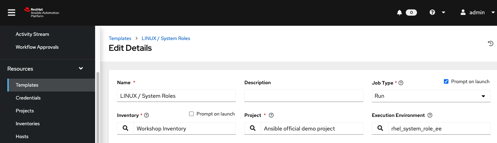

# Exercise 2.4 - Leveraging RHEL System Roles in AAP 2

## Table of Contents

* [Objective](#objective)
* [What Are Rhel System Roles](#step-1---run-linux--setup-builder)
* [Step 1 - Use the timesync RHEL system role](#step-2---create-custom-ee-with-rhel-system-roles-collection)
* [Step 2 - Use the firewall RHEL system role](#step-2---create-custom-ee-with-rhel-system-roles-collection)

## Objective

We have all the Automation Controller objects in place.  There are many use cases we can automate, but we will focus on one of the most powerful linux collections, RHEL System Roles.  With our new templates and EE in place, we will orchestrate many required tasks through a single job template, by simply providing variables that define our systems state.

## What are RHEL System Roles
RHEL System Roles are a collection of Ansible roles and modules that can help automate the management and configuration of RHEL Systems. RHEL System Roles can help provide consistent and repeatable configuration, reduce technical burdens, and streamline administration.

Administrators can select from a library of common services and configuration tasks provided by RHEL System Roles. This interface enables managing system configurations across multiple versions (RHEL 8, RHEL 7, and in some cases RHEL 6) and supports the execution of manual tasks consistently across physical, virtual, private cloud, and public cloud environments.

RHEL System Roles are supported with your RHEL subscription and are packaged as RPMs included with RHEL. However, if you have an Red Hat Ansible Automation Platform subscription and utilize Ansible Tower, you can also access the latest  RHEL System Roles from Ansible Automation Hub for use in Automation Controller (f.k.a. Tower).

Security-related roles:

  - <strong>selinux</strong> allows for configuration of SELinux.
  - <strong>certificate</strong> can manage TLS/SSL certificate issuance and renewal.
  - <strong>tlog</strong> configures session recording.
  - <strong>nbde_client</strong> and <strong>nbde_server</strong> configure network bound disk encryption.
  - <strong>ssh</strong> and <strong>sshd</strong> configure the SSH client and server, respectively.
  - <strong>crypto_policies</strong> configures the system-wide cryptographic policies.

Configuration-related roles:

  - <strong>timesync</strong> configures time synchronization.
  - <strong>network</strong> configures networking.
  - <strong>kdump</strong> configures the kernel crash dump.
  - <strong>storage</strong> configures local storage.
  - <strong>kernel_settings</strong> configure kernel settings.
  - <strong>metrics</strong> configures system metrics (using Performance Co-Pilot).
  - <strong>logging</strong> configures logging (rsyslog).
  - <strong>postfix</strong> (tech preview) configures the postfix email server.
  - <strong>ha_cluster</strong> (tech preview) manages high availability clustering.

For an up-to-date list of available roles, as well as a support matrix that details which versions of RHEL are supported by each role, [refer to this page](https://access.redhat.com/articles/3050101). 

## Step 1 - Use the **timesync** rhel system role
* Learn more about the timesync system roles.  What is its purpose?  What are the variable options that can define how your environment gets configured?
    * **Option1**: read the docs online:<br>
    [timesync/README.md](https://external.ink?to=/github.com/linux-system-roles/timesync/blob/master/README.md)
    * **Option2**: If you are feeling frisky, read the docs from the collection inside the container we just created.
        * From ansible-1, find the container image:
        ```bash
        $ podman images
        REPOSITORY                                                               TAG         IMAGE ID      CREATED       SIZE
        hub.rh4ccb.example.opentlc.com/student1_rhel_system_roles_ee             latest      f7c20a3a3d16  10 hours ago  612 MB
        ```
        * Open an interactive terminal inside the container and find out where the collection was installed:
        ```bash
        $ podman run --name rhel_roles -it hub.rh4ccb.example.opentlc.com/student1_rhel_system_roles_ee /bin/bash
        bash-4.4# ansible-galaxy collection list
        
        # /usr/share/ansible/collections/ansible_collections
        Collection               Version
        ------------------------ -------
        redhat.rhel_system_roles 1.20.0 
        ```
        * Use tab completion to find /usr/share/ansible/collections/ansible_collections/redhat/rhel_system_roles/docs
        ```bash
        bash-4.4# ls -l /usr/share/ansible/collections/ansible_collections/redhat/rhel_system_roles/docs/ 
        CHANGELOG.md                  CHANGELOG_nbde_server.md      README_cockpit.md             README_postfix.md             nbde_client/
        CHANGELOG_certificate.md      CHANGELOG_network.md          README_crypto_policies.md     README_selinux.md             nbde_server/
        CHANGELOG_cockpit.md          CHANGELOG_postfix.md          README_firewall.md            README_ssh.md                 network/
        CHANGELOG_crypto_policies.md  CHANGELOG_selinux.md          README_ha_cluster.md          README_sshd.md                selinux/
        CHANGELOG_firewall.md         CHANGELOG_ssh.md              README_kdump.md               README_storage.md             ssh/
        CHANGELOG_ha_cluster.md       CHANGELOG_sshd.md             README_kernel_settings.md     README_timesync.md            sshd/
        CHANGELOG_kdump.md            CHANGELOG_storage.md          README_logging.md             README_tlog.md                timesync/
        CHANGELOG_kernel_settings.md  CHANGELOG_timesync.md         README_metrics.md             README_vpn.md                 vpn/
        CHANGELOG_logging.md          CHANGELOG_tlog.md             README_nbde_client.md         certificate/                  
        CHANGELOG_metrics.md          CHANGELOG_vpn.md              README_nbde_server.md         ha_cluster/                   
        CHANGELOG_nbde_client.md      README_certificate.md         README_network.md             metrics/
        ```
        * Read the time sync docs from inside the container:
        ```bash
        bash-4.4# less /usr/share/ansible/collections/ansible_collections/redhat/rhel_system_roles/docs/README_timesync.md
        ```

* Now that we understand what values we can pass to timesync role, let's set our ansible-1 server (not practical) as the ntp server using chronyc as the ip protocol.
   * update **Linux / System Roles** job template with the new EE<br>
   (TIP: rhel_system_role_ee - may be on second page)
   
   * Add the following extra vars, defined by the role<br>
   (EXCEPTION: system_roles: \[timesync\]) is a list variable used to iterate through multiple roles in one run)
   ```yaml
   ---
   system_roles:
     - timesync
   timesync_ntp_servers:
     - hostname: “<IP of Ansible-1:  #you can pull from “Workshop Inventory -> hosts -> Ansible-1>”
       iburst: true
   ip_protocol: chronyd
  ```
  * Ensure “privilege escalation” is checked
  * Click **Save** -> Click **Next** -> * Click **Launch**
  * Enter **node** for host pattern<br>
  You will now see some output that will show you the tasks that were skipped and tasks that stayed the same, and tasks that made a change.  For the tasks that changed it will give you a glimpse as to what configuration file was changed and the setting that was added or taken away. 
* 
run adhoc commands in AC to review settings
Inventory
Select node1-3
Run Command
Module: command
Arguments: chronyc sources -v
Enable Privlege Escalation: enabled
Click: Next
Select “rhel_system_role_ee” -> Click “Next”
Select “Workshop Credential” -> Click “next”
Click “Launch”

## Step 2 - Use the **firewall** RHEL system role
* Learn more about the [**firewall system role**](https://external.ink?to=/github.com/linux-system-roles/firewall).  What is its purpose?  What are the [**variable options**](https://external.ink?to=/github.com/linux-system-roles/firewall#examples-of-options) that can define how you configure firewalld?
* Now that we have a better understanding on how to use the firewall rhel system role, let's put it into practice:
   * Update the same **Linux / System Roles** job template from step 1 with the following extra vars:<br>
   (NOTE: system_roles: \[firewall\]) key/value is updated to indicate which RHEL system role we intend to use.)
   ```yaml
   ---
   system_roles:
     - firewall
   firewall:
     - interface: eth2
       zone: trusted
       state: enabled
     - service: tftp
       state: enabled
  ```
By using the rhel system roles collection, we can create one job template that can be reused in an infinite number of ways.  The behavior of the job template execution changes based on the variables passed to it.  You can run a single role as an adhoc configuration, as we just did, or execute multiple roles with complex definitions based off of variable files devined in a project that can define how different groups of servers should be configured (i.e. by application, purpose, dev, prod, etc...).

RHEL System Roles also simplifies the process of managing the same configuration across several different RHEL OS versions such as RHEL 7 and RHEL 8, and in some cases RHEL 6.  Based on the role used, you would have the same variable definitions regardless of the underlying OS services/daemons that are used by the underlying OS (e.g. network role supports both initscripts/RHEL6 and network manager/RHEL78+ and it will autodetect the OS and configure accordingly).

----

[Return to the Workshop Exercises](../README.md)
